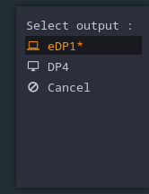
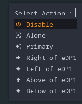

# rofi-monitor-selector

Simple script using rofi as GUI to setup multi-monitor environment. 

## Usage
Select outputs and then select action :

 -> 


Outputs list is dynamically build using [python-xlib](https://pypi.org/project/python-xlib/) api. Current primary output is marked with a "`*`".   
> Note : only connected outputs are displayed.

After output is selected, a new menu ask for action. 

Actions are : 
- `Disable` : Turn off selected output
- `Alone` : Keep only selected output on and turn off all others
- `Primary` : Set this output as primary output
- `Right of xxx` : Setup selected output to the **right** of current primary output
- `Left of xxx` : Setup selected output to the **left** of current primary output
- `Above of xxx` : Setup selected output to the **above** of current primary output
- `Below of xxx` : Setup selected output to the **below** of current primary output

## Dependencies

- Python 3 (tested on 3.10.4)
- [python-xlib](https://pypi.org/project/python-xlib/)
- [rofi](https://github.com/davatorium/rofi)
- [Nerd Font NotoSansMono](https://github.com/ryanoasis/nerd-fonts) for icons
- xrandr to run configuration changes

## Installation with i3

```bash
git clone git@github.com:qboileau/rofi-monitor-selector.git
cd ./rofi-monitor-selector

# Copy rofi themes on ~/.config/rofi
cp ./rofi-theme ~/.config/rofi

# Copy script on i3 configuration directory ~/.i3/scripts
mkdir -p ~/.i3/scripts
cp ./monitor-switcher.py ~/.i3/scripts
```
Then update i3 configuration to run this script on some binding.  
For exemple on `Mod + F6`.

`~/.i3/config` :
```
bindsym $mod+F6 exec python  ~/.i3/scripts/monitor-switcher.py
```

## Special thanks
Thanks to [EndeavourOS i3](https://github.com/endeavouros-team/endeavouros-i3wm-setup) team for inspiration and for a neat rofi theme configuration ! ❤️